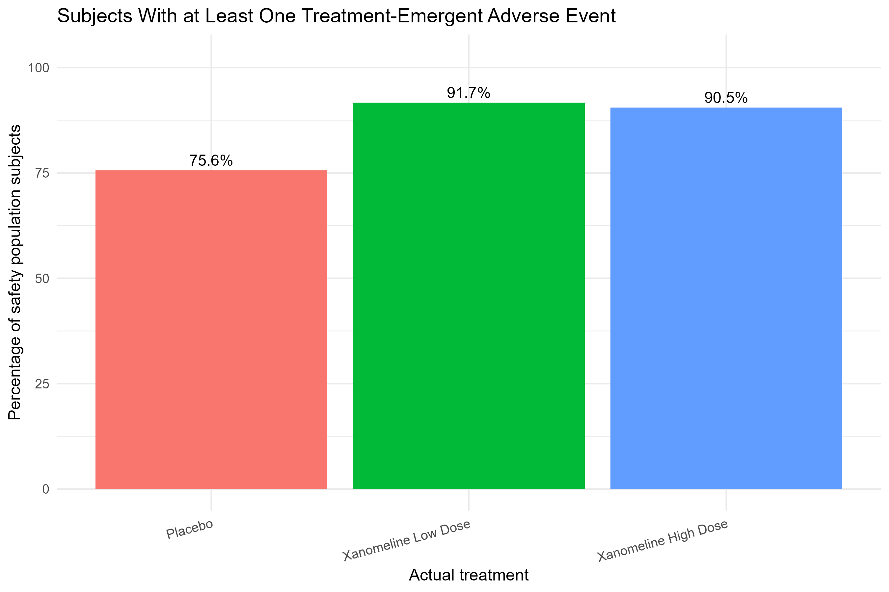
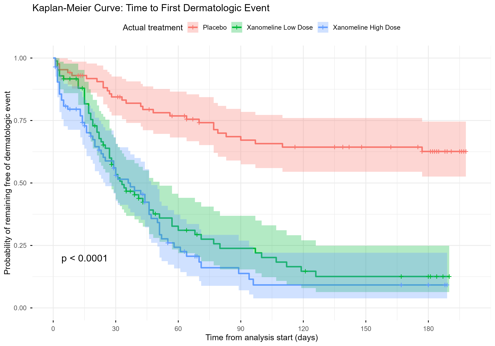
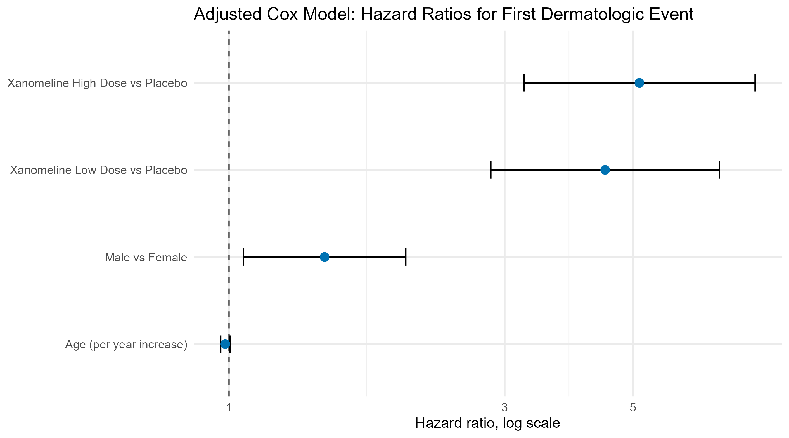

--- 
title: "Clinical Trial Safety and Time-to-Event Analysis Using CDISC SDTM/ADaM Pilot Data" 
author: "Akash Bhardwaj" 
date: today 
 
format: 
 html: 
   toc: true 
   toc-depth: 2 
   theme: cosmo 
   embed-resources: true 
 
execute: 
 echo: false 
 warning: false 
 message: false 
--- 
 
## Project objective 
 
This educational project uses public CDISC SDTM/ADaM pilot-study material to demonstrate a reproducible clinical-data analysis workflow in R. 
 
The workflow inspects SDTM-style tabulation datasets and ADaM-style analysis datasets, performs baseline and safety summaries, assesses cross-domain traceability, and conducts time-to-event analysis using Kaplan–Meier curves and Cox proportional-hazards regression. 
 
## Dataset source and scope 
 
The project uses the public CDISC SDTM/ADaM Pilot Project package. 
 
Selected datasets included: 
 
- SDTM `DM`: demographics; 
- SDTM `AE`: adverse events; 
- ADaM `ADSL`: subject-level analysis data; 
- ADaM `ADAE`: adverse-event analysis data; 
- ADaM `ADTTE`: time-to-event analysis data. 
 
The package contains public pilot material for educational and demonstration purposes. This project is not a sponsor submission, a validated SDTM/ADaM implementation, or a basis for clinical, regulatory, or treatment decisions. 
 
## Dataset inventory and analysis populations 
 
The selected datasets contained: 
 
| Dataset | Standard | Records | Unique subjects | 
|---|---|---:|---:| 
| ADSL | ADaM | 254 | 254 | 
| ADAE | ADaM | 1,191 | 225 | 
| ADTTE | ADaM | 254 | 254 | 
| DM | SDTM | 306 | 306 | 
| AE | SDTM | 1,191 | 225 | 
 
The safety population in ADSL included 254 subjects: 
 
- Placebo: 86; 
- Xanomeline Low Dose: 84; 
- Xanomeline High Dose: 84. 
 
Two selected baseline variables had one missing value each: baseline BMI and baseline weight. All other selected baseline variables were complete. 
 
## Baseline characteristics 
 
Baseline summaries were generated from the ADaM ADSL safety population. 
 
Mean age was similar across treatment groups: 
 
- Placebo: 75.2 years; 
- Xanomeline Low Dose: 75.7 years; 
- Xanomeline High Dose: 74.4 years. 
 
Baseline BMI means ranged from 23.6 to 25.3 kg/m² across groups. These descriptive summaries are included to demonstrate an analysis-ready subject-level workflow and should not be interpreted as formal balance testing. 
 
## Treatment-emergent adverse-event summary 
 
Treatment-emergent adverse events were identified using `TRTEMFL = "Y"` in ADAE. 
 
| Treatment | Subjects with at least one TEAE | Percentage | 
|---|---:|---:| 
| Placebo | 65 / 86 | 75.6% | 
| Xanomeline Low Dose | 77 / 84 | 91.7% | 
| Xanomeline High Dose | 76 / 84 | 90.5% | 
 
Serious treatment-emergent adverse events were uncommon: 
 
- Placebo: 0 subjects; 
- Xanomeline Low Dose: 1 subject (1.2%); 
- Xanomeline High Dose: 2 subjects (2.4%). 
 
 
 
These are descriptive summaries of public pilot data. They do not establish causal safety effects. 
 
## Time-to-event endpoint 
 
The ADaM ADTTE dataset contained one endpoint: 
 
```text 
Time to First Dermatologic Event 
``` 
 
The analysis included 254 subjects: 
 
- 152 subjects had a dermatologic event; 
- 102 subjects were censored at study completion; 
- Median analysis time was 40 days. 
 
Event percentages were: 
 
| Treatment | Event percentage | Median analysis time | 
|---|---:|---:| 
| Placebo | 33.7% | 139.0 days | 
| Xanomeline Low Dose | 73.8% | 29.5 days | 
| Xanomeline High Dose | 72.6% | 24.5 days | 
 
## Kaplan–Meier analysis 
 
 
 
A log-rank test indicated differences in time to first dermatologic event across treatment groups: 
 
```text 
Chi-squared = 60.3 
Degrees of freedom = 2 
p-value = 8.18e-14 
``` 
 
## Cox proportional-hazards model 
 
An exploratory Cox model adjusted for age and sex, using placebo as the reference group. 
 
| Variable | Hazard ratio | 95% confidence interval | p-value | 
|---|---:|---|---:| 
| Xanomeline Low Dose vs Placebo | 4.47 | 2.84 to 7.06 | <0.001 | 
| Xanomeline High Dose vs Placebo | 5.13 | 3.24 to 8.13 | <0.001 | 
| Age, per year | 0.99 | 0.97 to 1.00 | 0.118 | 
| Male vs Female | 1.46 | 1.06 to 2.02 | 0.021 | 
 
 
 
The Schoenfeld-residual proportional-hazards test did not identify evidence against the proportional-hazards assumption: 
 
```text 
Global p-value = 0.75 
``` 
 
These results describe associations in the public pilot dataset only. They do not establish causal treatment effects or clinical safety conclusions. 
 
## Cross-domain traceability checks 
 
### Subject coverage 
 
All selected subject links matched: 
 
- 254 of 254 ADSL safety-population subjects were represented in SDTM DM. 
- 225 of 225 ADAE subjects were represented in SDTM AE. 
- 254 of 254 ADTTE subjects were represented in the ADSL safety population. 
 
### ADaM adverse-event traceability 
 
All 1,191 ADAE records linked to an SDTM AE source record using `USUBJID` and `AESEQ`. 
 
- Linked source AE records: 1,191; 
- Unlinked source AE records: 0; 
- Preferred-term matches: 1,191; 
- Severity matches: 1,191. 
 
### ADTTE event traceability 
 
All 152 ADTTE dermatologic-event records linked to an SDTM AE source record using `USUBJID` and the source sequence. 
 
### Treatment alignment review 
 
Planned treatment matched between ADSL and DM for all 254 safety-population subjects. 
 
Actual-treatment values matched for 242 subjects. Twelve subjects had treatment differences between ADSL and DM: 
 
- ADSL planned treatment: Xanomeline High Dose; 
- ADSL actual treatment: Xanomeline High Dose; 
- SDTM DM actual arm: Xanomeline Low Dose. 
 
All 12 subjects had discontinued treatment. Recorded reasons included adverse events, subject withdrawal, protocol violation, physician decision, and sponsor study termination. 
 
This review demonstrates that treatment variables from different clinical datasets require documented derivation rules and contextual review. Differences should not automatically be treated as data errors. 
 
## Reproducibility 
 
The CDISC Pilot Project source repository was downloaded locally from the official CDISC GitHub repository. 
 
Run the R scripts in this order: 
 
```text 
scripts/01_install_packages.R 
scripts/02_inspect_cdisc_pilot_data.R 
scripts/03_profile_adam_analysis_data.R 
scripts/04_baseline_and_safety_summaries.R 
scripts/05_time_to_event_analysis.R 
scripts/06_cross_domain_traceability_checks.R 
scripts/07_review_treatment_alignment.R 
``` 
 
## Limitations 
 
- This project uses public CDISC pilot material rather than a real sponsor clinical-study database. 
- The analysis is educational and does not represent validated CDISC programming or a regulatory submission. 
- No statistical analysis plan, controlled terminology validation, define.xml review, or formal data-validation process was performed. 
- Safety and time-to-event outputs are descriptive or exploratory. 
- Treatment differences observed across domains require interpretation in the context of documented derivation rules and study metadata. 
- Results must not be used for clinical, regulatory, or treatment decisions. 
 
## Conclusion 
 
This project demonstrates an industry-style clinical-data workflow using public CDISC SDTM/ADaM pilot data. 
 
It combines baseline analysis, treatment-emergent adverse-event summaries, Kaplan–Meier curves, Cox regression, proportional-hazards diagnostics, cross-domain subject coverage, source-record traceability, and treatment-alignment review in a reproducible R project. 
 
